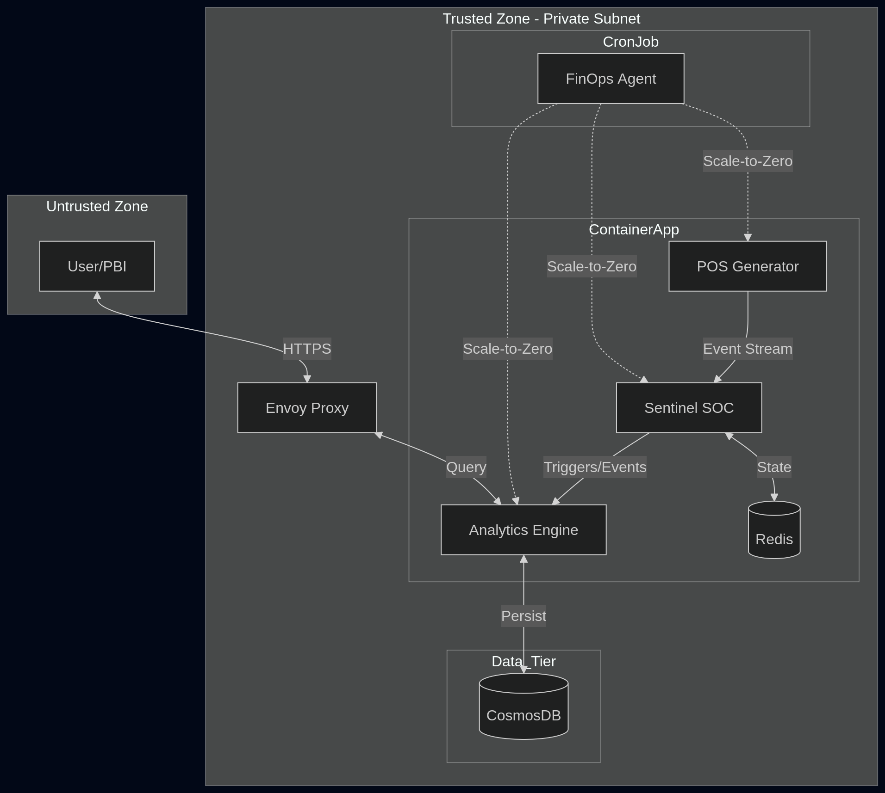

# Sentinel SOC | Enterprise POS Anomaly Detection

### The Core Infrastructure

* **Telemetry Generator (Go):** Simulates the event stream from external vendors (like SevenRooms or Impos). 
* **The Sentinel SOC Agent (Go):** The security and cognitive routing layer.
* **Analytics Engine (C# .NET 10):** The persistence and read gateway. It receives the evaluated telemetry from the Sentinel and writes it to the Cosmos DB NoSQL database. It will also host the `[HttpGet]` endpoints for dashboard queries.
* **FinOps SRE Bot (Go):** Deployed via Terraform as an Azure Container App Job (CronJob). It wakes up hourly, queries the Azure Cost Management API, and forcefully scales the compute nodes to zero if the budget is breached.




## Architecture

### Zero-Trust API Gateway (Envoy Proxy)
To protect the critical ingestion pipeline, the underlying database and logic engine are isolated from the public internet within an Azure Virtual Network. External traffic is routed through an immutable Envoy API Gateway, dynamically configured via Terraform. This gateway exposes the dashboard to stakeholders while strictly blocking unauthorized access to ingestion endpoints, utilizing automatic Host header rewriting to prevent routing loops.

### High-Performance Ingestion and State (Go + Redis TLS)
The ingestion tier is implemented in Go, utilizing Azure Cache for Redis to manage sliding transaction windows across multiple geographic venues. Connectivity is secured via TLS 1.2. To ensure resource stability, Redis lists are aggressively trimmed and expired to prevent memory exhaustion during traffic spikes.

### Asynchronous Persistence (C# .NET 10 + Cosmos DB)
The backend analytics engine leverages .NET 10 Minimal APIs to asynchronously persist security events to Azure Cosmos DB. It utilizes a dual-serializer bridge (System.Text.Json for performance and Newtonsoft.Json for SDK compatibility) to ensure reliable data serialization and high-throughput ingestion.

### Enterprise Observability (OTLP over gRPC)
Console logging is suppressed in production to eliminate CPU I/O bottlenecks and minimize Log Analytics costs. The architecture utilizes W3C OpenTelemetry (OTel) via gRPC. Traces are intercepted by a managed Azure sidecar on port 4317 and forwarded to Azure Application Insights, providing a real-time Dependency Map and latency analysis.

### Automated FinOps (Scale-to-Zero)
To optimize cloud expenditure, the infrastructure heavily utilizes Kubernetes Event-driven Autoscaling (KEDA). Background workers, such as the synthetic POS generator, are governed by strict cron triggers to scale to zero replicas outside of standard Australian hospitality trading hours, resuming instantly upon network triggers.

## Tech Stack
* **Ingestion & Edge Triage:** Go (Goroutines, OTLP gRPC)
* **API Gateway:** Envoy (Alpine)
* **Analytics Engine:** C# / .NET 10 Minimal APIs
* **Distributed State:** Azure Cache for Redis (TLS 1.2)
* **Persistence:** Azure Cosmos DB (NoSQL)
* **Observability:** OpenTelemetry, Azure Application Insights
* **Infrastructure as Code:** Terraform (AzureRM and AzAPI providers)
* **DNS & Routing:** Cloudflare (DNS-Only / Grey Cloud)
* **CI/CD:** GitHub Actions with Azure remote state backend

## Deployment and Operations

### Prerequisites
* Go 1.26.3
* .NET 10 SDK
* Azure CLI and Terraform

### Continuous Deployment (CI/CD)
Infrastructure deployment is fully automated via GitHub Actions.
1. Infrastructure state is maintained remotely in an Azure Storage Blob (`stsentinelstate`).
2. Pull requests trigger `terraform plan` for automated validation.
3. Merges to the `main` branch trigger a hands-free `terraform apply` using Azure Service Principal credentials.

## Troubleshooting

### Terraform

Make sure you this service is activated `Microsoft.App` otherwise run

```shell
az provider register --namespace Microsoft.App
```

### Environments

**For staging/production:**

***Creating key vault***

```shell
az keyvault create \
  --name "production-keyvault" \
  --resource-group "rg-hospitality-capstone" \
  --location "australiaeast"
```

***Adding the secret***

```shell
az keyvault secret set \
  --vault-name "production-keyvault" \
  --name "finops-subscription-id" \
  --value "actual-subscription-id-here"
```

***Appinsights / connection refuse***

* When you configure OpenTelemetry (OTLP) in code, it defaults to sending traces to localhost:4318. In Azure Container Apps (ACA), Microsoft provides a Managed OpenTelemetry Agent that runs silently in the background on that exact port to intercept your traces and forward them to Application Insights.

```shell
az containerapp env telemetry app-insights set \
  --name <your-container-app-environment-name> \
  --resource-group rg-hospitality-capstone \
  --connection-string "<your-app-insights-connection-string>" \
  --enable-open-telemetry-traces true \
  --enable-open-telemetry-logs true
```

***Azure Image***

Since you're likely going to be pushing and pulling images frequently, you can skip the az acr login command entirely and use Podman's native login with your Azure credentials.

```shell
# 1. Get the login server name
# set ACR_NAME "acrhospitalitycapstone"
# set LOGIN_SERVER $(az acr show --name $ACR_NAME --query loginServer --output tsv)

ACR_NAME="acrhospitalitycapstone"
LOGIN_SERVER=$(az acr show --name $ACR_NAME --query loginServer --output tsv)

# 2. Log in using your Azure CLI identity
az acr login --name $ACR_NAME --expose-token --output tsv --query accessToken | podman login $LOGIN_SERVER -u 00000000-0000-0000-0000-000000000000 --password-stdin
```

***docker build and push***

```shell
docker build -t acrhospitalitycapstone.azurecr.io/sentinel-soc:v1 .
docker push acrhospitalitycapstone.azurecr.io/sentinel-soc:v1
```
